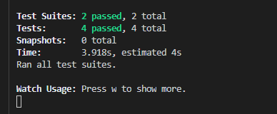

# Homework Assignment 19 - Employee Directory


---

## Description

For this assignment, students were tasked with creating a employee directory web application with React. In using React, this web application was designed creating UI components, managing component state, and able to respond to user events.

In additional to using React, I took the opporunity to incorporate _unit testing_ for certain functionality used to develop this application. Please reference the _Testing_ section in this readme.

---

## Table of Contents

- [Links for Submission Items](#links-for-submission-items)
- [Assignment Scope](#assignment-scope)
- [Installation and Testing](#installation-and-testing)
- [Final Output](#final-output)

---

## Links to Submission Items

Link to GitHub Repo - [https://github.com/KEDuran/employee_directory](https://github.com/KEDuran/employee_directory)

Link to deployed application - [https://employee-directory-ked.herokuapp.com/](https://employee-directory-ked.herokuapp.com/)

---

## Assignment Scope

### User Story

The user story provided below was included in this homework assignment's instructions.

```
As a user, I want to be able to view my entire employee directory at once so
that I have quick access to their information.
```

### Acceptance Criteria

For this assignment, the user should be able to conduct the following functionality when interacting with the employee directory application:

- Sort the table by at least one category

- Filter the users by at least one property.

---

## Installation and Testing

### Required Technology

In order to success launch this web application, you will need to have the following installed in your local working environment:

- **Node.js** - Make sure Node.js is installed in your machine. If Node.js is not installed on your machine, click here to download the application.

### Installation Instructions

All NPM packages needed for this application are already listed as dependencies in the `package.json` file. If running this web application in your local environment, please make sure to run the `npm install`command in your terminal at the root directory level in order to access all required package.

### Start Application

After all required dependencies have been installed using the instructions in the _Installation Instructions_ section, run the command `npm start` in you the terminal under the root directory in order to launch the application. The screenshot provided below is what should outplu of the application is launched successfully in your local environment.

### Testing

When checking to see if all applicable unit tests pass throughout the development of this application, make sure to run the `npm test` command in your terminal each time you would like to test the application.

There are two test suites (one suite per component) and four individual unit tests (two unit tests per component) included within this application. All incorporated unit tests pass - as demonstrated in the terminal screenshot below.



---

## Final Output
